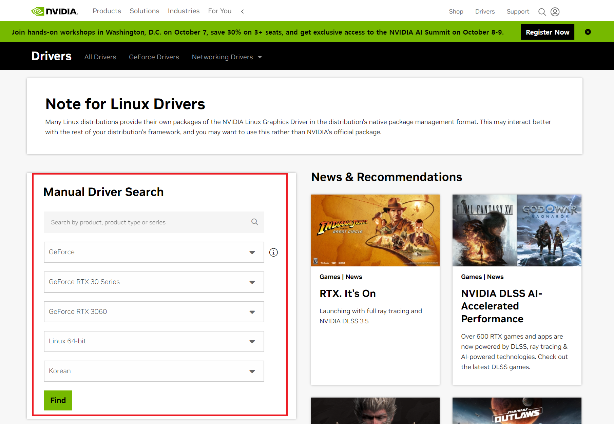
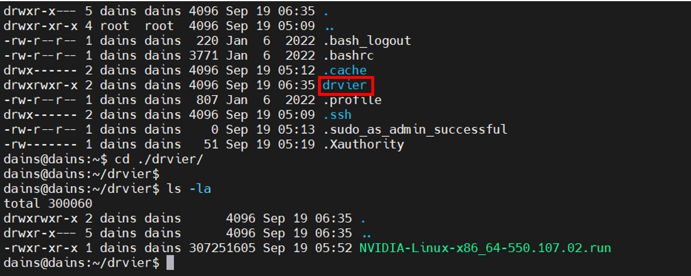

# Linux Graphic Driver 설정 잡기

**✅사전 준비 사항**
- Ubuntu Server 22.0 LTS 버전 설치

<hr>

## ✏️ 그래픽 드라이브 다운로드
- OS 정보 확인
  ```bash
  lsb_release -a 
  ```
  
  ```bash
  unmae -a 
  ```
  
- 그래픽 정보 확인
  ```bash
  lspci | grep VGA
  ```
  
- [NVIDIA Driver 다운로드](https://www.nvidia.com/download/index.aspx) <br>
  **위에서 찾은 정보 바탕으로 드라이버를 검색한다.**
  
  
  
- run 파일 서버에 업로드
  ```bash
  scp NVIDIA-Linux-x86_64-550.107.02.run [계정명]@[host]:[옮길 위치]
  ```
  

## ✏️ 사전작업

### Nouveau Kernel Driver 시스템 블랙리스트 추가

- 커널에서 Nvidia Driver 커널과 충돌이 일어나므로 시스템 블랙리스트 목록에 추가해서 충돌 방지를 해준다.
```bash
sudo apt-get -y remove nvidia* && sudo apt -y autoremove
```
#### Nvidia 관련 패키지를 모두 삭제 하고 남아있는 불필요한 패키지들을 자동 삭제한다.


```bash
sudo apt install -y dkms build-essential linux-headers-generic pkg-config libglvnd-dev
```
#### 커널 모듈 개발 및 Nvidia 드라이버 설치 등 필요한 패키지 설치


```bash
sudo echo -e "blacklist nouveau\nblacklist lbm-nouveau\noptions nouveau modeset=0\nalias nouveau off\nalias lbm-nouveau off" | sudo tee -a /etc/modprobe.d/blacklist.conf
```
#### nouveau, lib-nouveau 드라이브를 블랙리스트에 추가하여 우분투 시스템에 로드 되지 않도록 설정


```bash
sudo update-initramfs -u
```
#### 드라이버 변경이나 커널 관련 설정을 수정한 후에 실행하여 부팅 과정에서 필요한 파일 및 드라이버가 올바르게 로드되도록 보장함


```bash
sudo reboot
```
#### 재부팅

#### Docker 설치
```bash
sudo apt-get -y install apt-transport-https ca-certificates curl gnupg-agent software-properties-common
curl -fsSL https://download.docker.com/linux/ubuntu/gpg | sudo apt-key add -
sudo add-apt-repository "deb [arch=amd64] https://download.docker.com/linux/ubuntu $(lsb_release -cs) stable"
sudo apt -y update
sudo apt-get -y install docker-ce docker-ce-cli containerd.io
sudo systemctl start docker && sudo systemctl enable docker
sudo usermod -aG docker dains
```

## ✏️ 그래픽 드라이브 설치
```bash
sudo apt -y install build-essential
sudo apt -y install pkg-config
sudo apt -y install libglvnd-dev
sudo apt -y install freeglut3-dev
sudo apt -y install libglu1-mesa-dev
sudo apt -y install mesa-common-dev
sudo apt -y install mesa-utils
sudo apt -y install unzip
sudo apt -y install wget
sudo chmod +x [설치파일명].run
sudo ./[설치파일명].run
nvidia-smi
```
#### 안내문구나오면 계속 설치, Yes...

#### Nvidia Container-Toolkit 설치 & Production 저장소 구성
```bash
sudo curl -fsSL https://nvidia.github.io/libnvidia-container/gpgkey | sudo gpg --dearmor -o /usr/share/keyrings/nvidia-container-toolkit-keyring.gpg \
  && curl -s -L https://nvidia.github.io/libnvidia-container/stable/deb/nvidia-container-toolkit.list | \
    sed 's#deb https://#deb [signed-by=/usr/share/keyrings/nvidia-container-toolkit-keyring.gpg] https://#g' | \
    sudo tee /etc/apt/sources.list.d/nvidia-container-toolkit.list
```

#### Nvidia Container Tool Kit 설치
```bash
sudo docker info | grep -i runtimes
sudo apt-get -y update
sudo apt-get install -y nvidia-container-toolkit
```

#### Nvidia Container Runtime Engine 구성
```bash
sudo nvidia-ctk runtime configure --runtime=docker
sudo systemctl restart containerd
sudo systemctl restart docker
```
#### Cuda Toolkit 설치 및 설정
[Cuda Toolkit Download](https://developer.nvidia.com/cuda-downloads?target_os=Linux&target_arch=x86_64&Distribution=Ubuntu&target_version=22.04&target_type=runfile_local)
```bash
sudo wget [최신 파일명]
sudo chmod +x [최신 파일명]
sudo ./[최신 파일명]
```
#### 설치 과정에서 동의 입력 하고 설치 옵션에서 documentation 해제 후 설치

#### 환경변수 잡기
```bash
echo -e "\nexport PATH=/usr/local/cuda-12.6/bin:\$PATH\nexport LD_LIBRARY_PATH=/usr/local/cuda-12.6/lib64:\$LD_LIBRARY_PATH" >> ~/.bashrc
source ~/.bashrc
nvcc --version
```

```bash
sudo apt -y install ubuntu-desktop
sudo reboot
```

<hr>

## ✏️ Remote GUI 를 위한 Tiger VNC 설치
```bash
sudo apt -y install tigervnc-standalone-server
sudo apt -y install dbus-x11
sudo apt -y install pkg-config
sudo apt -y install xserver-xorg-dev

sudo mv /etc/X11/xorg.conf /etc/X11/xorg.conf.org   => 만약에 없다고 나오면 스킵
mkdir .vnc && cd .vnc && touch xstartup && cd

cat > /home/dains/.vnc/xstartup << 'EOF'
#!/bin/sh

unset SESSION_MANAGER
unset DBUS_SESSION_BUS_ADDRESS
[ -r $HOME/.Xresources ] && xrdb $HOME/.Xresources
vncconfig -iconic &
"$SHELL" -l << 'EOF2'
export XDG_SESSION_TYPE=x11
export GNOME_SHELL_SESSION_MODE=ubuntu
setxkbmap -layout us
dbus-launch --exit-with-session gnome-session --session=ubuntu
EOF2
EOF

sudo chmod 755 /home/skw/.vnc/xstartup
echo -e "\nexport DISPLAY=:1" >> ~/.bashrc
source ~/.bashrc

## VNC Server Systemd 서비스 등록
sudo touch /etc/systemd/system/vncserver@.service
sudo chmod 777 /etc/systemd/system/vncserver@.service

cat > /etc/systemd/system/vncserver@.service << EOF
[Unit]
Description=Remote desktop service (VNC)
After=syslog.target network.target

[Service]
Type=simple
User=skw
PAMName=login
PIDFile=/home/%u/.vnc/%H%i.pid
ExecStartPre=/bin/bash -c '/usr/bin/vncserver -kill :%i > /dev/null 2>&1 || :'
ExecStart=/usr/bin/vncserver :%i -geometry 1920x1080 -localhost no -alwaysshared -fg
ExecStop=/usr/bin/vncserver -kill :%i

[Install]
WantedBy=multi-user.target
EOF

sudo systemctl daemon-reload
sudo chown skw:skw /home/skw/.vnc

sudo reboot
```