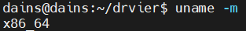

# Linux Graphic Driver 설정 잡기

**✅사전 준비 사항**
- Ubuntu Server 22.0 LTS 버전 설치

<hr>

## ✏️ 그래픽 드라이브 다운로드
- OS 정보 확인
  ```bash
  lsb_release -a 
  ```
  
  ```bash
  unmae -a 
  ```
  
- 그래픽 정보 확인
  ```bash
  lspci | grep VGA
  ```
  
- [NVIDIA Driver 다운로드](https://www.nvidia.com/download/index.aspx) <br>
  **위에서 찾은 정보 바탕으로 드라이버를 검색한다.**
  
  