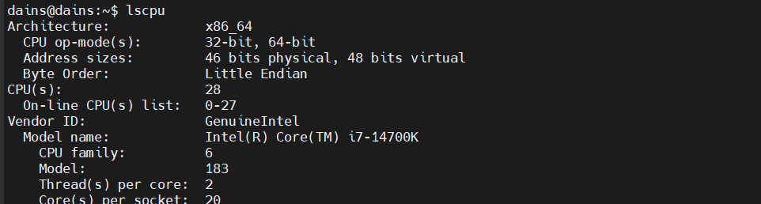
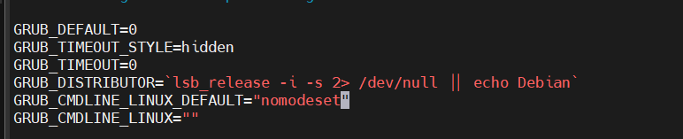

# 그래픽 드라이버 충돌 사건

<hr>

## 🤔 드라이브 충돌
블랙리스트 추가 > nvidia & cuda 설치 및 설정 > VNC 설치 후 재부팅하면 다음과 같은 문제가 발생된다.


emitting device (0006 -> 0007) => GPU 또는 디스플레이 초기화 중에 문제가 가능성을 발견
### 그래픽 드라이버 문제
 - 부팅중 디스플레이 관리 모듈 (i915)에서 문제가 발생했을 가능성 존재
 - Intel 통합 드라이버(i915)가 적절히 로드하지 못했거나, 커널 버전 충돌 가능성

### 기존 설치해왔던 CPU 버전이 달라 처음보는 문제가 생긴것으로 판단


문제되는 CPU 버전



개발서버 CPU 버전

### 해결방안
- 부팅시 `Shift` 키를 누른다.
- Ubuntu 선택 한뒤 `e` 키를 눌러 편집 모드 진입
- `linux` 시작하는 줄을 찾아 맨끝에 `nomodeset` 을 추가한다.
  ```bash
  linux /boot/vmlinuz-... root=UUID=... # before
  linux /boot/vmlinuz-... root=UUID=... nomodeset # after
  ```
- `Ctrl + X`을 눌러 수정된 설정으로 부팅한다.
#### 정상 부팅 시 - GRUB 설정을 영구적으로 수정
```bash
sudo vi /etc/default/grub
```
`GRUB_CMDLINE_LINUX_DEFAULT` 항목 맨 끝에 `nomodeset` 추가한다.

파일을 저장한다.
GRUB 업데이트 명령어를 실행합니다.
```bash
sudo update-grub
```
시스템을 재부팅합니다.


