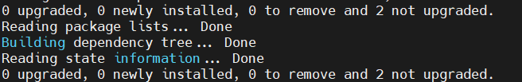
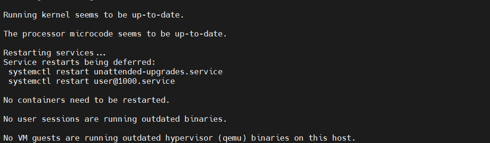
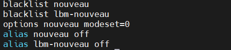
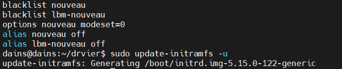

# 서버 기본 설정 및 설치
- 커널에서 Nvidia Driver 커널과 충돌이 일어나므로 시스템 블랙리스트 목록에 추가해서 충돌 방지를 해준다.
```bash
sudo apt-get -y remove nvidia* && sudo apt -y autoremove
```
#### Nvidia 관련 패키지를 모두 삭제 하고 남아있는 불필요한 패키지들을 자동 삭제한다. 



```bash
sudo apt install -y dkms build-essential linux-headers-generic pkg-config libglvnd-dev
```
#### 커널 모듈 개발 및 Nvidia 드라이버 설치 등 필요한 패키지 설치



```bash
sudo echo -e "blacklist nouveau\nblacklist lbm-nouveau\noptions nouveau modeset=0\nalias nouveau off\nalias lbm-nouveau off" | sudo tee -a /etc/modprobe.d/blacklist.conf
```
#### nouveau, lib-nouveau 드라이브를 블랙리스트에 추가하여 우분투 시스템에 로드 되지 않도록 설정



```bash
sudo update-initramfs -u
```
#### 드라이버 변경이나 커널 관련 설정을 수정한 후에 실행하여 부팅 과정에서 필요한 파일 및 드라이버가 올바르게 로드되도록 보장함



```bash
sudo reboot
```
#### 재부팅

