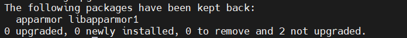

# 서버 기본 설정 및 설치

<hr>

## 기본 패키지 설치

패키지 목록을 최신 상태로 갱신하고 설치된 패키지를 최신 버전으로 업그레이드

```bash
sudo apt -y update && sudo apt -y upgrade
```



sudo 권한 추가

```bash
sudo usermod -aG sudo dains
```

자바 17 설치

```bash
sudo apt -y install openjdk-17-jdk
```

ffmpeg 설치

```bash
sudo apt -y install ffmpeg
```

net-tools 설치

```bash
sudo apt -y install net-tools
```

#### yarn 설치
```bash
curl -sL https://dl.yarnpkg.com/debian/pubkey.gpg | sudo apt-key add -
echo "deb https://dl.yarnpkg.com/debian/ stable main" | sudo tee /etc/apt/sources.list.d/yarn.list
sudo apt -y install yarn
```
- yarn 패키지 저장소의 GPG 공개키를 다운로드하여 그 공개키를 apt 에 추가한다. 서명 검증이 가능
- yarn 패키지 저장소를 시스템에 추가하는 작업을 수행, 이후 yarn 패키지를 apt 를 통해 설치가 가능
- yarn 패키지 설치


#### nodeJS 설치
```bash
curl -fsSL https://deb.nodesource.com/setup_20.x | sudo -E bash -
sudo apt-get -y install nodejs
sudo npm install --global yarn
sudo npm install --global next
```

#### Docker 설치
```bash
sudo apt-get -y install apt-transport-https ca-certificates curl gnupg-agent software-properties-common
curl -fsSL https://download.docker.com/linux/ubuntu/gpg | sudo apt-key add -
sudo add-apt-repository "deb [arch=amd64] https://download.docker.com/linux/ubuntu $(lsb_release -cs) stable"
sudo apt -y update
sudo apt-get -y install docker-ce docker-ce-cli containerd.io
sudo systemctl start docker && sudo systemctl enable docker
sudo usermod -aG docker dains
```

#### RabbitMQ
```bash
sudo docker run -d --name rabbit --restart unless-stopped -p 1883:1883 -p 4369:4369 -p 5671:5671 -p 5672:5672 -p 15672:15672 -p 15674:15674 -p 25672:25672 rabbitmq:3-management
sudo docker exec rabbit rabbitmq-plugins enable rabbitmq_mqtt
sudo docker exec rabbit rabbitmq-plugins enable rabbitmq_web_mqtt
sudo docker exec rabbit rabbitmq-plugins enable rabbitmq_web_stomp
sudo docker exec rabbit rabbitmqctl add_user admin admin
sudo docker exec rabbit rabbitmqctl set_user_tags admin administrator
sudo docker exec rabbit rabbitmqctl set_permissions -p / admin ".*" ".*" ".*"
sudo docker exec rabbit rabbitmqctl enable_feature_flag all
sudo docker restart rabbit
```

#### MariaDB
```bash
sudo docker run -d --name maria --restart unless-stopped -e MARIADB_ROOT_PASSWORD=1234 -p 5001:3306 mariadb
docker ps
docker exec -it [컨테이너 아이디] /bin/bash
mariadb -u root -p1234
create database dains character set utf8mb4 collate utf8mb4_general_ci;
create user '아이디'@'%' identified by '비밀번호';
grant all privileges on [데이터베이스 명].* to '아이디'@'%';
flush privileges;
```

#### Redis
```bash
sudo docker run -d --name redis --restart unless-stopped -p 5002:6379 redis
```
