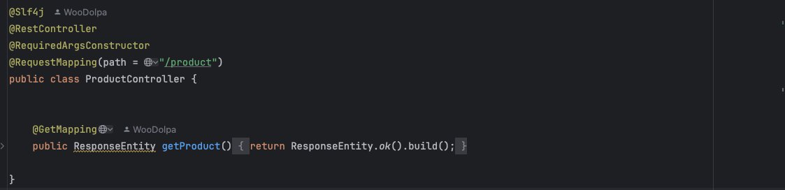
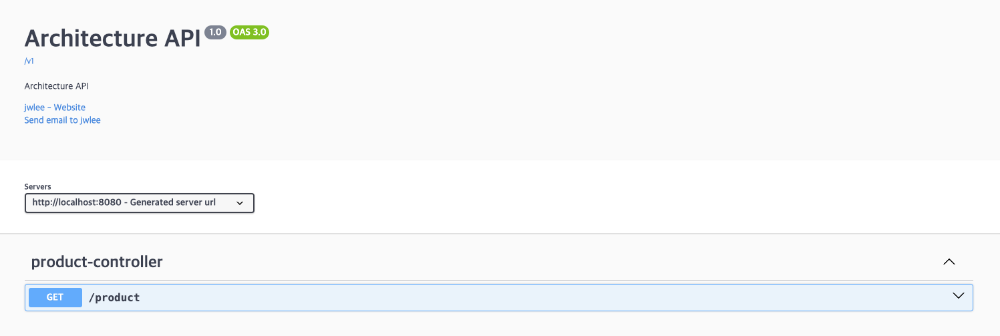
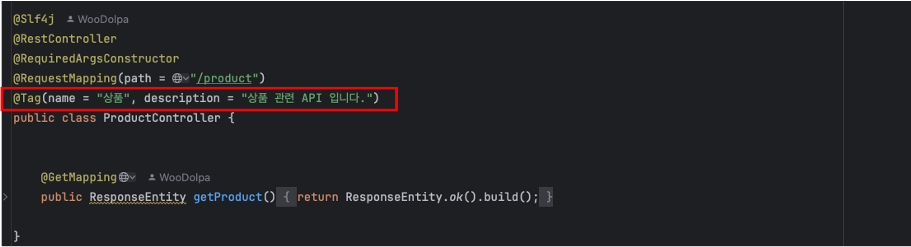
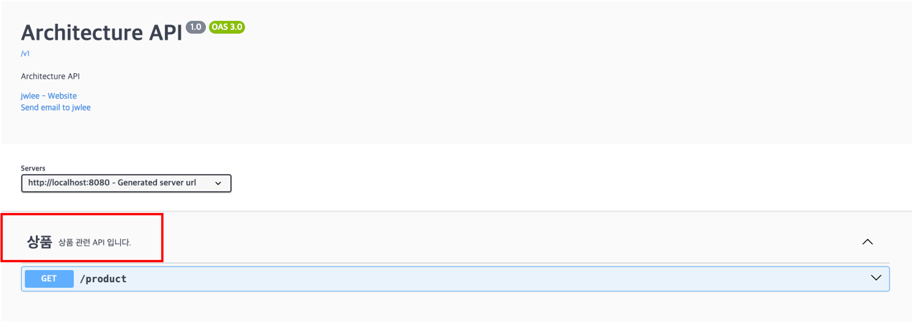
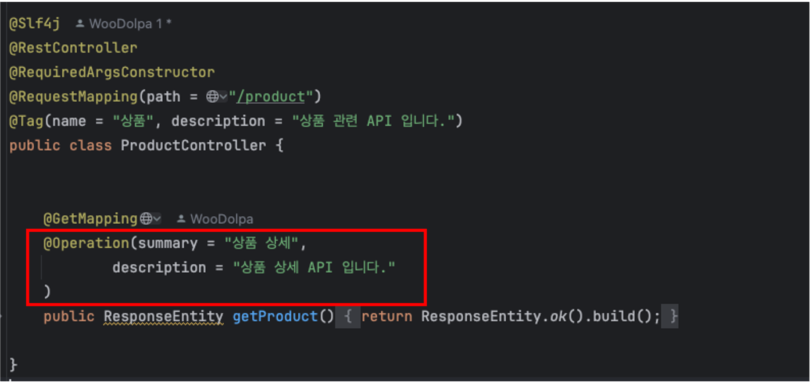
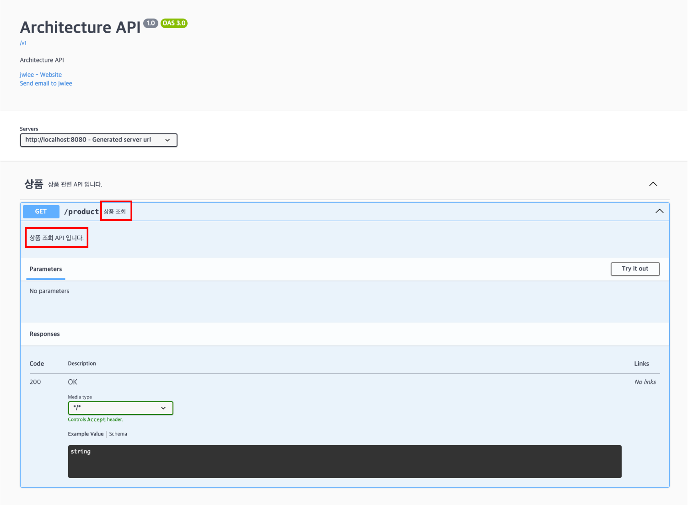

# SpringDocs API 만들기

---

이번에는 간단한 API를 만들어 보겠습니다.  
개인 프로젝트에서 상품 관련 CURD 가 필요하여 만들어 보겠습니다. 

---

먼저 ProductController 클래스를 만들고 다음과 같이 작성합니다. 

작성 후 애플리케이션을 실행하여 결과는 다음과 같습니다.

여기서 `product-controller` 단어만 보면 상품 관련된 controller 라고 유추가 가능하지만 조금 더 논리적으로 해보겠습니다.

## @Tag
`@Tag` 어노테이션은 API 엔드포인트를 그룹화하는 데 사용됩니다.
이를 통해 API 문서에서 논리적으로 관련된 엔드포인트들을 함께 묶어 더 이해하기 쉽게 만들 수 있습니다.

<table>
    <thead>
        <tr>
            <th>속성</th>
            <th>설명</th>
        </tr>
    </thead>
    <tbody>
        <tr>
            <td>name</td>
            <td>태그명</td>
        </tr>
        <tr>
            <td>description</td>
            <td>태그에 대한 설명을 제공합니다.</td>
        </tr>
    </tbody>
</table>

`@Tag` 적용은 다음과 같습니다.

적용 후 실행하게되면 결과는 다음과 같습니다.

조금 더 직관적으로 확인이 가능해졌습니다.

## @Operation
`@Operation` 어노테이션은 특정 API에 대한 메타 데이터를 정의하는데 사용합니다.

<table>
    <thead>
        <tr>
            <th>속성</th>
            <th>설명</th>
        </tr>
    </thead>
    <tbody>
        <tr>
            <td>summary</td>
            <td>API 엔드포인트의 간단한 설명을 제공</td>
        </tr>
        <tr>
            <td>description</td>
            <td>API 엔드포인트의 설명을 제공</td>
        </tr>
        <tr>
            <td>tags</td>
            <td>엔드포인트 그룹화 지정</td>
        </tr>
        <tr>
            <td>parameters</td>
            <td>매개변수를 정의</td>
        </tr>
        <tr>
            <td>responses</td>
            <td>엔드포인트의 응답을 정의</td>
        </tr>
        <tr>
            <td>requestBody</td>
            <td>엔드포인트 요청 Body 정의</td>
        </tr>
        <tr>
            <td>deprecated</td>
            <td>엔드포인트가 더 이상 사용되지 않음을 나타냄</td>
        </tr>
    </tbody>
</table>

정리한 속성 외에 다른 속성 정보는 공식 문서 또는 어노테이션 내부를 확인하면 될거 같습니다.

Get API에 대한 메타 데이터 선언은 다음과 같습니다.

적용 후 실행하게되면 결과는 다음과 같습니다.

---

## 마무리
다음은 제가 만든 사이드 프로젝트로 API 만들어보고 공유하도록 하겠습니다.

---

제가 정리한 내용이 잘못되었거나 틀렸을 경우 댓글로 공유해주시면 확인 후 수정하겠습니다!  
감사합니다. 🙇
