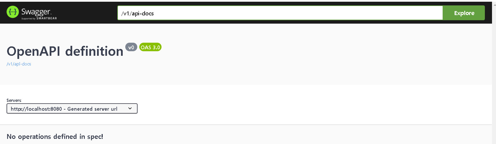
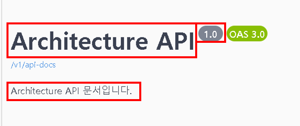

# springdoc-openapi 사용하기

## 목차
- 서론
- SpringFox vs SpringDoc 어떤걸 선택해야 할까?
- 사이드 프로젝트로 SpringDoc 라이브러리 사용해보자!

---

## 서론
7월부터 회사 신규 프로젝트에 들어갈 예정이며, 이번에는 다른 업체와 협업을 해야하는 상황이 발생하였다. <br>
Restful API 설계 및 개발을 하면서 문서화 및 공유를 위해 Swagger 선택했고 그중 SpringFox 와 SpringDoc 라이브러리를 찾게 되었다.

---

## SpringFox vs SpringDoc 어떤걸 선택해야 할까?
여러 글들을 읽어보고 찾아보면서 SpringFox 보다 SpringDoc을 권장하는 글들이 많이 보인다
이유는 다음과 같다.

- SpringFox는 2020년 7월(3.0.0 버전)이후로 **더 이상 업데이트되지 않는다.**([github](https://github.com/springfox/springfox/releases) 기준)
- SpringFox는 **OAS 3를 지원하지 않는다.**
- SpringFox는 **SpringBoot 3 사용이 불가능하다.**

위에 적은내용 외에 더 추가적인 확인은 [SpringDoc 공식 홈페이지](https://springdoc.org/index.html#differentiation-to-springfox-project) 에서 확인 가능하다.

현재 사내에서 SpringBoot 3 버전을 사용하므로 별다른 고민없이 **SpringDoc** 을 선택했다.

---

## 사이드 프로젝트로 SpringDoc 라이브러리 사용해보자!

예전 진행했던 사이드 프로젝트가 리뉴얼 되면서 새롭게 v2로 가야하는 상황이 발생하였다.
이번 기회에 마이그레이션 하면서 SpringDoc를 적용해보려고 한다.

- SpringBoot v3.3.0
- springdoc-openapi v2.5.0

**build.gradle**
- dependencies에 라이브러리를 추가
```groovy
implementation 'org.springdoc:springdoc-openapi-starter-webmvc-ui:2.5.0'
```

**application.yaml**
```yaml
springdoc:
  api-docs:
    path: /v1/api-docs  # path 설정 지정하지 않을 경우 기본값 : /v3/api-docs
  swagger-ui:
    path: /api # HTML 문서 경로를 지정한다. 기본값 : /swagger-ui.html
```
자세한 설명 및 추가옵션은 [SpringDoc 공식 홈페이지](https://springdoc.org/#springdoc-openapi-core-properties)에서 확인하면된다. <br>
위의 설정이 완료되면 서버를 실행하여 `[IP]:[Port][swagger-ui.path]` 접속하여 확인한다.


 
여기서 문서 제목과 버전 그리고 설명을 추가 해보겠습니다.
<br>

**Config 클래스 생성**
```java
@Configuration
public class OpenApiConfig {

    @Bean
    public OpenAPI customOpenAPI() {
        return new OpenAPI()
                .info(new Info()
                                .title("Architecture API")
                                .version("1.0")
                                .description("Architecture API 문서입니다.")
                        );
    }
}

```

생성 후 서버 재시작 한뒤 다시 접속한다.


**변경 확인**

## 마무리
다음은 제가 만든 사이드 프로젝트로 API 만들어보고 공유하도록 하겠습니다.

---

제가 정리한 내용이 잘못되었거나 틀렸을 경우 댓글로 공유해주시면 확인 후 수정하겠습니다! <br>
감사합니다. 🙇

## 출처
https://blog.naver.com/seek316/223349824088 <br>
https://yeonyeon.tistory.com/322
## 레퍼런스(Reference)
https://github.com/springdoc/springdoc-openapi <br>
https://springdoc.org <br>

