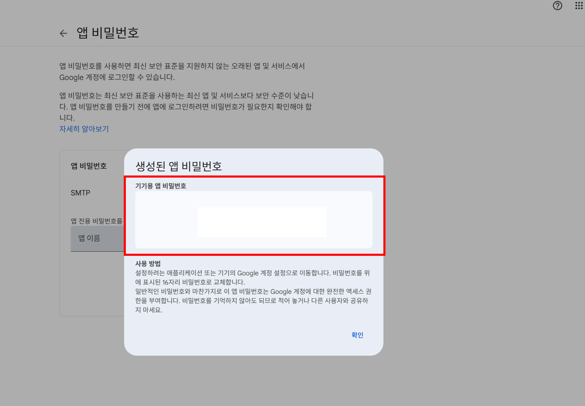

Google 계정 설정

Google 계정 로그인 후 Mail 앱 들어가기



비밀번호 16자리 확인

1. Spring Boot 프로젝트 생성
2. 의존성 추가
   `build.gradle`파일에 Spring Boot Mail Starter 의존성을 추가

```groovy
implementation 'org.springframework.boot:spring-boot-starter-mail'
```

3. `application.yml` 파일에 아래와 같이 Google SMTP 서버 정보를 입력

```ymal
spring:
  mail:
    host: smtp.gmail.com
    port: 587
    username: [Gmail 주소]
    password: [위에서 발급받은 16자리 앱 비밀번호] 
    properties:
      mail:
        smtp:
          auth: true
          starttls:
            enable: true
```

4. 컨트롤러 생성 & DTO 클래스 생성
```java
@PostMapping(path = "/inquiry")
@Operation(summary = "이메일 발송",
        description = "이메일 발송"
)
public ResponseEntity<String> findInquiry(@RequestBody InquiryDto dto) {
    emailService.simpleTest(dto);
    return ResponseEntity.ok()
            .contentType(MediaType.APPLICATION_JSON)
            .body(ApiResponseDto.makeSuccessResponse());
}
    
// ====================================================================================

@Getter
@NoArgsConstructor
public class InquiryDto {

    private String name;
    private String mobile;
    private String email;
    private String contents;
}
```
5. MailService 클래스 생성
```java
@Slf4j
@Service
@RequiredArgsConstructor
public class EmailService {

    private final JavaMailSender mailSender;

    public void simpleTest(InquiryDto dto) {

        MimeMessage mimeMessage = mailSender.createMimeMessage();

        try {

            MimeMessageHelper helper = new MimeMessageHelper(mimeMessage, true, "UTF-8");

            helper.setTo(ApiConstants.MAIL_TO); // 수신자 메일
            helper.setSubject(ApiConstants.MAIL_SUBJECT); // 제목
            helper.setText(getHtmlContent(dto), true); // HTML 사용

            mailSender.send(mimeMessage);

        } catch (Exception e) {
            log.error("[EmailService][simpleTest] error exception : {}", e.getMessage());
        }
    }
    // -- htmlContent 메서드 생략 
}
```

6. 테스트 확인

