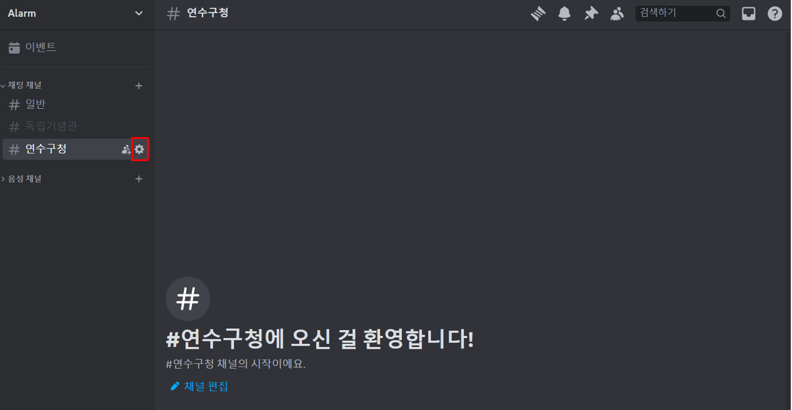
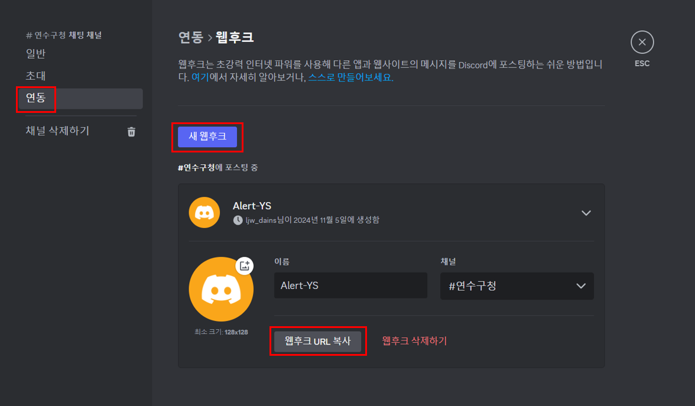

# Discord WebHook 연동

<hr>

- WebHook 설정할 채널의 편집 설정에 들어간다.

- 연동 탭에서 새웹후크 클릭후 웹후크를 다음과 같이 설정한다.


### 코드작성
[Discord WebHook API 사용법](https://discord.com/developers/docs/resources/channel#create-message)
```json
{
  "content": "Hello, World!",
  "tts": false,
  "embeds": [{
    "title": "Hello, Embed!",
    "description": "This is an embedded message."
  }]
}
```

### MessageDTO
```java
@Data  
public class MessageDto {  
    private String content;  
    private boolean tts = false; // 텍스트 음성 변환  
    private List<Embed> embeds = new ArrayList<>();  
  
  
    @Data  
    public static class Embed {  
        private String title;  
        private String description;  
    }  
}
```