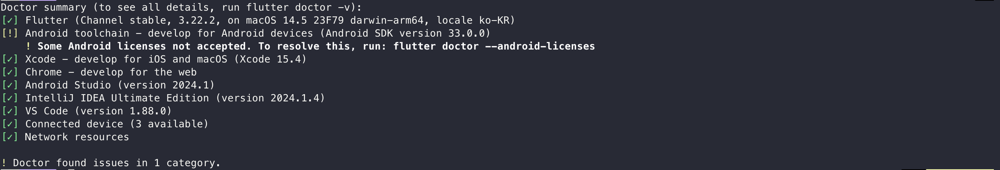

# Flutter 설치 및 개발환경 만들기(Mac)

### Flutter SDK 설치

- 공식 홈페이지 접속 [링크](https://flutter.dev)
- 메인 우측 상단에 Get started 버튼 클릭
- 자신 원하는 플랫폼 선택합니다.(글쓴이는 macOS > iOS)
- Apple silicon Mac(M1 ~)은 Rosetta 2 를 설치해야 한다. 

- [Flutter SDK 설치에서 자신이 맞는 환경으로 선택한다.](https://docs.flutter.dev/get-started/install/macos/mobile-ios#install-the-flutter-sdk)
- zip 압축파일을 압축해제 합니다.
- 환경변수 파일(.zshrc)애 경로를 추가하고 저장한뒤 적용합니다.
~~~ shell
export PATH=$HOME/development/flutter/bin:$PATH

source [환경변수 파일]
~~~
- 저장한 뒤에 flutter 입력 하면 설치가 되고 flutter --version 입력하면 설치된 버전 정보가 보여집니다.

## Flutter 환경 체크

#### 플러터에서 개발 환경을 체크하는 방법이 있습니다.
~~~ shell
flutter doctor 
~~~

#### 결과 화면
- Android toolchain 이 안맞다.
- Xcode가 설치가 안되어있음
- Android Studio 가 설치되어 있지 않음

## 안드로이드 스튜디오 설치

#### 안드로이드 스튜디오 설치는 Jetbrains Toolbox 통해서 간편 설치를 진행하였습니다.

#### 설치가 완료되면 안드로이드 스튜디오를 실행시킵니다. 실행이 되면 절차는 다음과 같습니다.

#### 버그 리포트 나 이슈가 있는것을 구글쪽에 보낼것인지 여부(저는 보내는것으로 선택하였습니다.)

#### (next 진행)

#### 저는 기본으로 진행하기 때문에 `standard` 로 진행하였습니다.

#### `finish` 버튼을 클릭하면 설치가 진행됩니다. 

#### `finish` 버튼을 클릭하여 설치가 완료되었습니다. 

#### `Plugins > flutter 설치` 플러그인이 설치되면서 Dart관련 플러그인도 같이 설치된다.

## xcode 설치

#### `App Store 개발 > Xcode`을 찾아 설치합니다.

#### 설치 후 터미널로 가서 `flutter doctor` 명령어로 통해 확인합니다.

#### xcode 관련 명령어를 다음과 같이 입력하여 실행합니다.

~~~ shell
sudo xcode-select --switch [설치된 디렉토리 경로]  # Xcode의 개발자 도구 경로 설정을 합니다.
sudo xcodebuild -runFirstLaunch # Xcode 설치 후 초기 설정을 완료하는 데 사용 
~~~
#### 다시 `flutter doctor` 명령어를 실행하여 상태 확인합니다.

`CocoaPods not installed` => CocoaPods 설치가 필요합니다.
~~~ shell
brew install cocoapods 
~~~

#### 다시 `flutter doctor` 명령어를 실행하여 상태 확인합니다.

#### 아래 명령어 실행을 시뮬레이터를 설치합니다.
~~~ shell
xcodebuild -downloadPlatform iOS
~~~

## Android 설정 마저하기!

#### `cmdline-tools component is missing` 해결 방법은 다음과 같습니다.

#### `상단 Android Studio > Settings > Languages & Frameworks ` 위의 이미지처럼 선택 후 설치합니다.

#### `cmdline-tools component is missing` 문제가 해결하였습니다.

#### 마지막으로 아래의 명령어를 실행하여 라이센스 문제를 해결할 수 있습니다.

~~~ shell
flutter doctor --android-licenses
~~~

#### 전부 `yes` 하여 설치하였습니다.

#### 다시 `flutter doctor` 명령어를 실행하여 상태 확인합니다.

### 해결

## 첫 프로젝트를 만들어보자!

#### 먼저 `New Flutter Project` 클릭합니다.

#### Flutter SDK 설치 경로를 선택해 줍니다.

#### 테스트 입니다.
